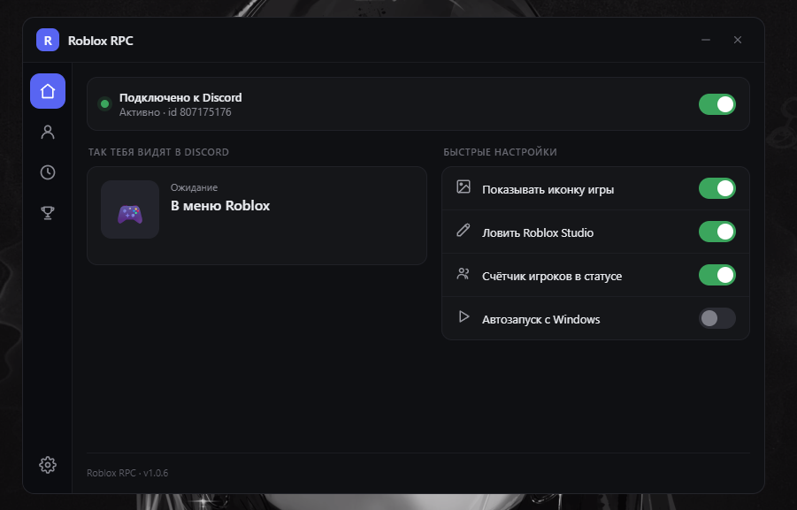
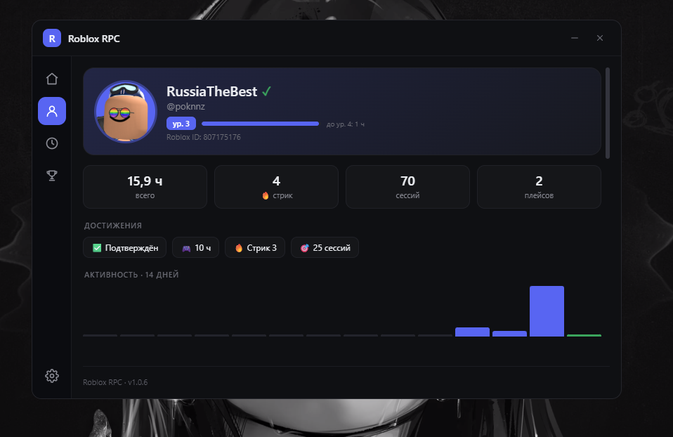
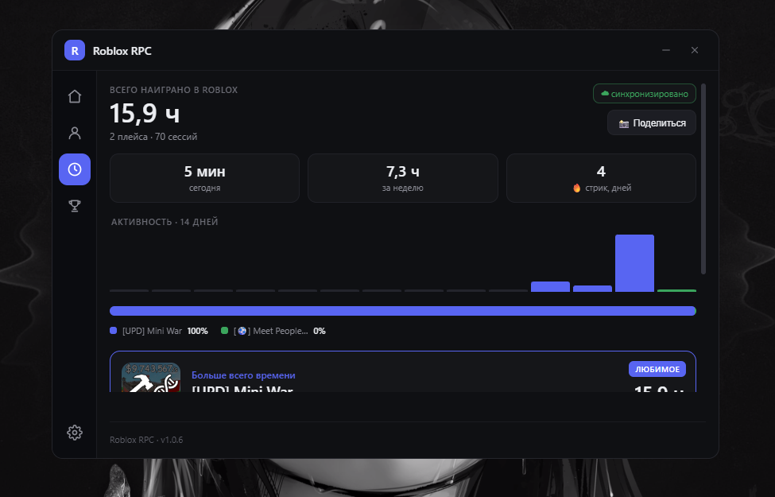
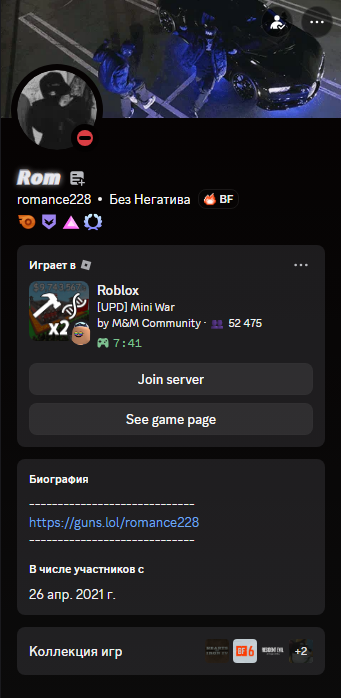

# Roblox RPC

<!-- ================= ЛОГО ================= -->

### Discord Rich Presence • Счётчик часов • Облачный лидерборд

Красивый **Discord Rich Presence** с отображением игрового времени и синхронизацией с облачным лидербордом.

[⬇ Скачать последнюю версию](../../releases/latest)

---

## ✨ Возможности

- 🎮 Красивый статус в Discord
- ⏱️ Автоматический подсчёт часов игры
- ☁️ Облачный лидерборд игроков
- 🚀 Быстрые обновления через GitHub Releases
- 💻 Минимальная нагрузка на систему
- 🔄 Автоматическая синхронизация

---

# 📸 Скриншоты

---

## 📥 Установка

1. Перейдите во вкладку **Releases**.
2. Скачайте последнюю версию.
3. Запустите установщик.
4. Откройте Roblox.
5. Наслаждайтесь красивым Rich Presence.

---

## ⚙️ Как это выглядит

---

## 📊 Что отображается

- 👤 Имя игрока
- 🎮 Текущая игра
- ⏳ Проведённое время
- 🏆 Позиция в лидерборде

---

## 🔄 Обновления

Все новые версии публикуются во вкладке **Releases**.

---

## ❤️ Поддержка

Если проект понравился — поставьте ⭐ репозиторию.

Это помогает развитию проекта.

---

**Made with ❤️ for Roblox Community**

